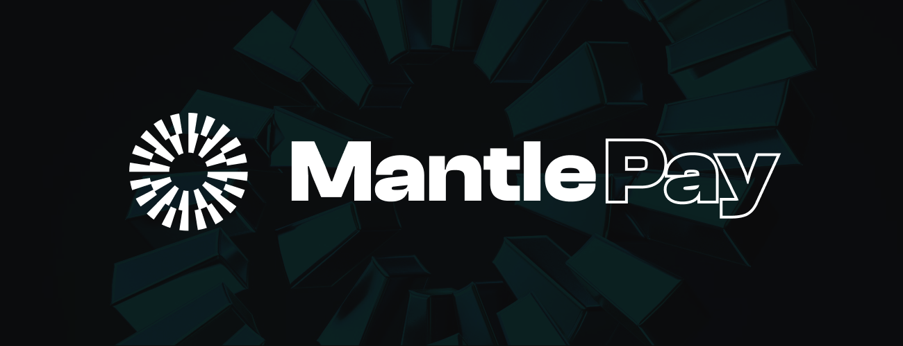

# MantlePay
## Overview

MantlePay is a blockchain-based platform that enables the creation of invoices and secure payments on the Ethereum network through the Mantle network. With MantlePay, sending and receiving payments become more convenient and efficient.

## Features

- Create invoices with specified amount, comment, payment wallet (optional), and invoice recipient (optional).
- Receive payment links for the created invoices that can be forwarded through any messenger.
- Notify the invoice recipient and display the unpaid invoice in their personal account by specifying their wallet.
- Option to specify a payment wallet for the funds, or have the funds sent to the wallet used to create the invoice.

## Technical details

MantlePay consists of two main components: a Solidity smart contract and a dapp that provides a user-friendly interface for interacting with the contract. The app operates on the <a target="_blank" href="https://www.mantle.xyz/">Mantle</a>[Mantle] network, which allows for fast, cheap and secure blockchain transactions on the Ethereum network.

## How to use MantlePay

1. Install and set up a wallet that supports the Ethereum network and the Mantle network.
2. Access the MantlePay dapp through your wallet or a web browser.
3. Create an invoice by specifying the amount, comment, payment wallet (optional), and invoice recipient (optional).
4. Forward the payment link for the created invoice to the desired recipient.
5. The invoice recipient can view the unpaid invoice in their personal account and make the payment through their own wallet.

## Conclusion

MantlePay provides a streamlined solution for secure payments on the blockchain. With its user-friendly interface and the added convenience of invoice creation and payment links, MantlePay offers a convenient and efficient alternative to traditional cryptocurrency transfers.
