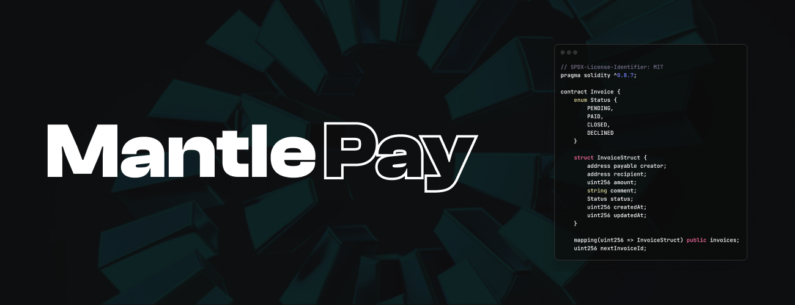

# MantlePay Contract

## Prerequisites
- Node.js and yarn installed

## Getting Started

1. Navigate to the project directory in your terminal.
2. Run `yarn` to install the project dependencies.
3. Copy `.env.example` to `.env` and setup the variables
4. Compile the contract via `yarn compile`.
5. Deploy the contract by running `yarn deploy --network mainnet`.
    - `yarn deploy --network testnet` for testnet deploy.
6. Verify the contract on Etherscan by running `yarn verify 0xfcB9fB578D44D8f4db6AE8Ab4c690E95304EFA6E --network <network>`.
