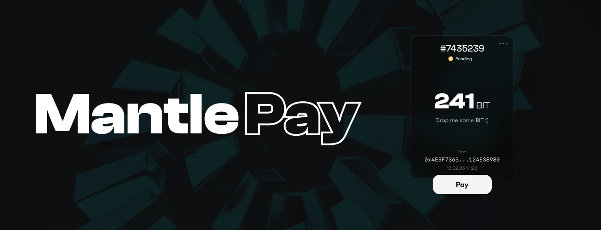

# MantlePay DApp

## Prerequisites

- Node.js and yarn installed
- Cloned repo

## Getting Started

1. Navigate to the project directory in your terminal.
2. Run `yarn` to install the project dependencies.
3. Copy `.env.example` to `.env.local` and setup the variables
4. Start the development environment by running `yarn dev`.
5. Open your browser and navigate to http://localhost:3000 to access the app.

## Note

The default port for the Next.js development server is `3000`. If the port is already in use, you can specify a different one by adding the `-p` option, for example: `yarn dev -p 3001`.
